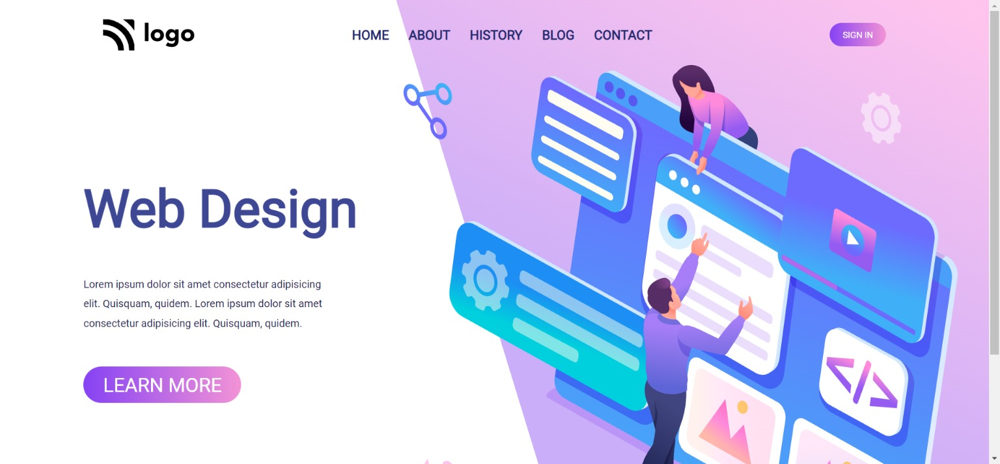

# Web Design Landing Page

Made by **Omprasad Dornala**

## Description

This is a sample page. This webpage focuses on positioning of elements and background images.

## Built with

- Semantic HTML
- CSS
- Flexbox

## Key learnings

- Absolute positioning of elements.
- To apply background images.

## Time taken

- This project took me more than one hour of time.

## Deployed Version Link

- [Live Demo](https://web-design-landing-page-op.netlify.app/)

## Snapshot of Webpage

